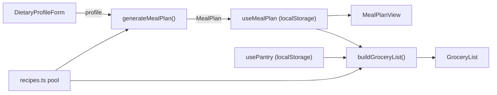

# Architecture: PantryPlan MVP

> Covers Feature 1 (Weekly Meal Plan Generator — MVP), Feature 2 (Pantry Inventory Tracker), and Feature 3 (Consolidated Grocery List) from FEATURES.md.

## Current State vs. Target Stack

The project's `CLAUDE.md` lists Clerk (auth) and Convex (database) as the target stack, but neither is installed yet — those are introduced in Module 3 (`/start-3-1` onward). To avoid blocking on infrastructure that isn't set up yet, this MVP is designed to run **entirely client-side** first, with a clear seam to migrate to Convex + Clerk later without reworking the UI.

| Layer | V1 (Module 2, now) | V2 (Module 3+) |
|---|---|---|
| Data source | Static curated recipe library (local JSON/TS) | Same, or Convex-hosted recipe table |
| Persistence | `localStorage`, via custom hooks | Convex mutations/queries |
| Auth | None — single implicit local user | Clerk |
| Plan generation | Deterministic rule-based filtering (no external API) | Optionally swap in Claude API for generative variety |

## Data Model

```typescript
// src/lib/types.ts
export interface Recipe {
  id: string
  name: string
  tags: DietTag[]           // e.g. ['vegetarian', 'gluten-free']
  prepTimeMinutes: number
  ingredients: Ingredient[]
  instructions: string[]
}

export interface Ingredient {
  name: string
  quantity: number
  unit: string               // 'g', 'cup', 'unit', etc.
  category: IngredientCategory // 'produce' | 'protein' | 'dairy' | 'pantry' | 'other'
}

export type DietTag = 'vegetarian' | 'vegan' | 'gluten-free' | 'dairy-free' | 'nut-free' | 'pescatarian'

export interface DietaryProfile {
  householdSize: number
  dietTags: DietTag[]
  excludedIngredients: string[]  // free-text exclusions (allergies, dislikes)
}

export interface MealPlan {
  id: string
  createdAt: string
  days: MealPlanDay[]           // exactly 7 entries
}

export interface MealPlanDay {
  dayIndex: number              // 0-6
  recipeId: string
}

export interface PantryItem {
  name: string
  quantity: number
  unit: string
}

export interface GroceryListItem {
  name: string
  quantity: number
  unit: string
  category: IngredientCategory
}
```

## Core Modules

### `src/lib/recipes.ts`
Static array of ~30-40 curated `Recipe` objects covering common diet tags. Enough variety to avoid obvious repetition across a few weeks, without needing an external API or database for V1.

### `src/lib/mealPlanGenerator.ts`
```typescript
function generateMealPlan(profile: DietaryProfile, recipePool: Recipe[]): MealPlan
```
- Filters `recipePool` to recipes matching all `profile.dietTags` and excluding any with `excludedIngredients`
- Randomly selects 7 recipes without repeats (falls back to allowing repeats only if the filtered pool has fewer than 7 matches, with a warning surfaced in the UI)
- Pure function, fully unit-testable with no side effects

### `src/lib/groceryListBuilder.ts`
```typescript
function buildGroceryList(plan: MealPlan, recipes: Recipe[], pantry: PantryItem[]): GroceryListItem[]
```
- Merges ingredients across all 7 recipes (summing quantities for matching name+unit pairs) — this is the fix for the #1 research complaint (lists not matching plans due to poor consolidation)
- Subtracts matching pantry item quantities from the merged list
- Groups the result by `category` for a shoppable, aisle-organized list

### `src/hooks/useLocalStorageState.ts`
Generic hook: `useLocalStorageState<T>(key: string, initialValue: T)`. Used to back `useMealPlan`, `usePantry`, and `useDietaryProfile` — this is the single seam that gets swapped for Convex queries/mutations in Module 3 without touching component code.

## Component Architecture

```
src/
├── lib/
│   ├── types.ts
│   ├── recipes.ts
│   ├── mealPlanGenerator.ts
│   └── groceryListBuilder.ts
├── hooks/
│   ├── useLocalStorageState.ts
│   ├── useMealPlan.ts
│   ├── usePantry.ts
│   └── useDietaryProfile.ts
├── components/
│   ├── meal-plan/
│   │   ├── DietaryProfileForm.tsx     # Feature 5 (P1) — collects prefs before generating
│   │   ├── MealPlanGenerator.tsx      # "Generate Plan" button + loading state
│   │   └── MealPlanView.tsx           # Renders the 7-day plan, one RecipeCard per day
│   ├── pantry/
│   │   └── PantryList.tsx             # Add/edit/remove pantry items
│   └── grocery/
│       └── GroceryList.tsx            # Renders categorized, consolidated list
└── app/
    └── plan/
        └── page.tsx                    # Composes the above into the MVP flow
```

## MVP Data Flow



## Why This Design Satisfies the Acceptance Criteria

- **Feature 1 (MVP):** `generateMealPlan` + `MealPlanView` directly satisfy "generates 7 distinct recipes" and "plan persists on reload" (via `useLocalStorageState`)
- **Feature 2:** `PantryList` + `usePantry` give a persistent, editable inventory
- **Feature 3:** `buildGroceryList` directly targets the research finding that lists don't match plans, by deriving the list programmatically from the plan and subtracting pantry state rather than hand-curating it

## Testing Strategy

- `mealPlanGenerator.ts` and `groceryListBuilder.ts` are pure functions — unit test with fixed recipe/pantry fixtures to assert exact output, including edge cases (empty pantry, pantry covering all ingredients, insufficient recipes matching diet tags)
- Component tests focus on the generate → view → grocery-list happy path

## Migration Path to Module 3

When Convex + Clerk are introduced:
1. Replace `useLocalStorageState` internals with Convex `useQuery`/`useMutation` — hook signatures stay the same, so consuming components don't change
2. Move `recipes.ts` static data into a Convex `recipes` table (seed script)
3. Scope `MealPlan`/`PantryItem` records by Clerk `userId`

---
*Architecture defined based on EPIC.md and FEATURES.md*
